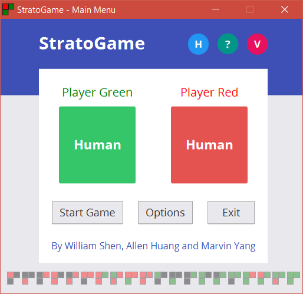
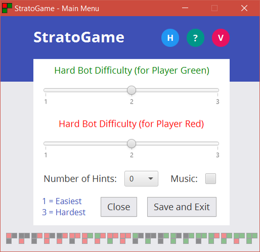
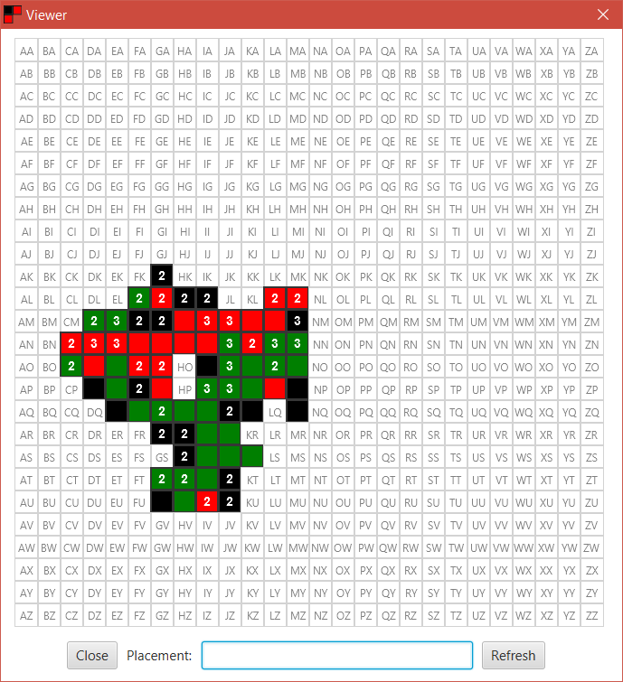
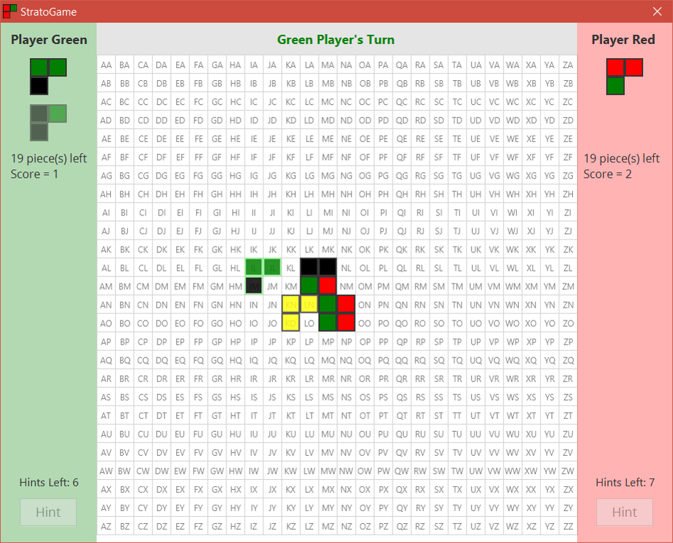
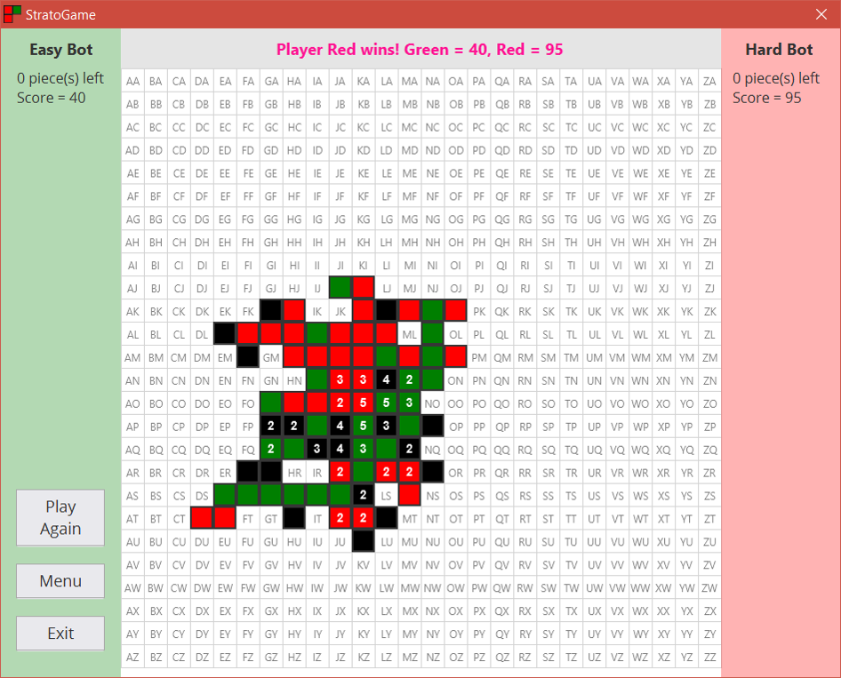

# Stratopolis

_Stratopolis_ is a strategy-based board game built using Java for the COMP1140 Group Assignment at the Australian National University (ANU).

___
## Summary and Design Approach
* **Modern and intuitive UI and UX design** - easy to use, aesthetically pleasing
* **Package Organisation** - easy to make changes if game rules are altered.
* **Abstraction** - breaking things down into smaller segments (e.g. Tiles have been broken down into Position, Shape (which is broken down into Colour), and Orientation. Making use of the object-oriented paradigm.
* **Features** - hints for human players, bot vs bot (including helpful console messages), HardBot difficulty, music, options menu, keyboard support, instructions, and tile placement viewer.

___
## Screenshots
#### Menu

#### Viewer

#### Gameplay

